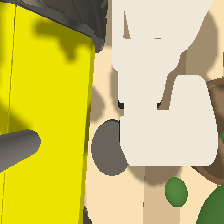
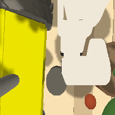
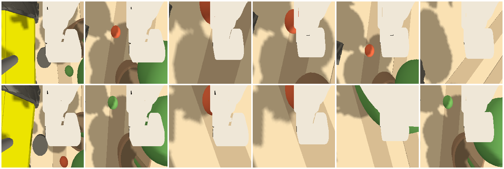
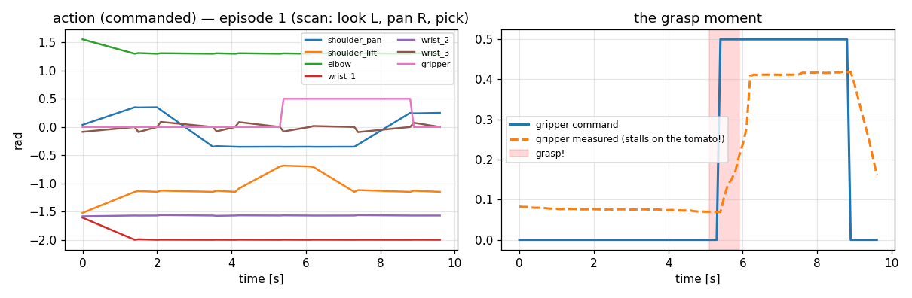

<!-- Author: Prof. Anis Koubaa <anis.koubaa@gmail.com> -->

# 🍅 `raise_ripeness_sort_ref` — the Day-2 reference dataset (with pictures!)

> **The robot demonstrated *"pick the red tomato"* to itself 50 times — parked
> at a tomato plant row, using a SCAN strategy: look above the left spot; if
> the tomato there is red, descend; if it's green, pan right and pick there.**
> Every frame shows greenhouse context AND is decidable from the image alone
> (LeRobot v3.0, ready to fine-tune SmolVLA). The model trained on this scores
> **100/100** on the Lab-2.2 evaluator.
>
> ⚠️ **"Where are the images?"** They are **inside the parquet files** —
> LeRobot packs every camera frame into `data/chunk-000/file-000.parquet`
> alongside the states and actions, so you won't see loose `.png`s in `data/`.
> The [`preview/`](./preview) folder below contains **extracted samples** so
> you can *see* the data right here on GitHub.

---

## What one episode looks like (through the robot's wrist camera)

Every episode is a **scan-then-pick**: look above the LEFT spot ➜ *(red? descend — else pan RIGHT)* ➜ descend ➜ **grasp** ➜ lift ➜ place. The red tomato swaps sides every episode, so the model must **look** to know where to go — and the scan guarantees the answer is in the image.

**Episode 0 — red on the LEFT** (watch it):



**Episode 1 — red on the RIGHT:**



### The six key moments, side by side

Top row = episode 0 (red left) · bottom row = episode 1 (red right).
Columns: start → approach → descend → **grasp** → lift → place.



Notice in the **last column** the red tomato is *gone* (carried away and
released) while the green distractor is untouched — that's the task, executed
and captured.

## What the numbers look like (the `action` signal)

Left: all 7 commanded values over episode 0 (6 arm joints + gripper).
Right: zoom on the gripper — the **command** snaps closed at the grasp moment
while the **measured** joint stalls on the tomato (that stall is *why* the
grasp trigger uses the command, not the measurement).



## The dataset, by the numbers

| | |
|---|---|
| Instruction | **"pick the red tomato"** |
| Episodes | **50** — 25 red-left + 25 red-right, all grasp-verified, zero discards |
| Frames | **4325** @ 10 Hz — red-left episodes are 76 frames, red-right 97 (the extra scan leg) |
| Camera | `observation.images.wrist` — 224×224×3 RGB |
| State / action | 7 floats — 6 UR5e joints + gripper |
| Quality | every episode's grasp **verified at record time**; 0 NaNs |
| Scene | robot parked facing the plant at (-2, 3) — **plants visible in every frame** |
| Size | ~39 MB (greenhouse visuals compress less than bare ground) |

## How much data was generated

**Raw sensor volume** (what the recorder actually captured):

| Stream | Per frame | × 4325 frames | Share |
|---|---|---|---|
| Wrist camera (224×224×3 uint8) | 147.0 KB | **621.0 MB** raw pixels | 99.98 % |
| State (7 × float32) | 28 B | 0.06 MB | 0.02 % |
| Action (7 × float32) | 28 B | 0.06 MB | 0.02 % |

**On disk after LeRobot's parquet compression** (measured):

| File | Size |
|---|---|
| `data/chunk-000/file-000.parquet` (all 4325 frames) | **38.3 MB** |
| `meta/` (episodes, stats, tasks, info) | 0.12 MB |
| `preview/` (human-viewable extracts, not training data) | 0.86 MB |
| **Total folder** | **≈ 39 MB** |

That's a **≈ 16× compression** of the raw pixel stream — ~0.8 MB per episode.
(Bare ground compressed ≈20×, foliage-heavy frames less. A nice lesson:
**richer context costs bytes**.)

**Generation rate** (headless sim, hands-free): 50 kept episodes in ~28 minutes
≈ **2 episodes/minute** — each episode is 7 s of recording plus ~23 s of
scene setup (spawn → home → pick → verify → cleanup). Scaling up is linear:
a 100-episode dataset would take ~50 minutes and ~50 MB on disk.

## Folder map

```
├── README.md                  ← you are here
├── preview/                   ← extracted sample images / GIFs / plots (for humans)
├── data/chunk-000/
│   └── file-000.parquet       ← THE data: 2100 rows of (image, state, action, task)
└── meta/
    ├── info.json              ← schema: features, shapes, fps, episode count
    ├── stats.json             ← per-feature min/max/mean/std (used for normalization)
    ├── tasks.parquet          ← the instruction string(s)
    └── episodes/…parquet      ← episode boundaries + per-episode metadata
```

## Look inside yourself

```bash
# load it and print a frame (venv python — lerobot needs numpy 2)
~/raise_venvs/lerobot/bin/python3 - <<'PY'
from lerobot.datasets.lerobot_dataset import LeRobotDataset
ds = LeRobotDataset('raiseschool/raise_ripeness_sort_ref', root='<this folder>')
print(ds.num_episodes, 'episodes |', ds.num_frames, 'frames @', ds.fps, 'Hz')
print(ds[0]['task'], '| action:', ds[0]['action'])
PY

# or REPLAY an episode into the live sim and watch the arm redo it:
06_d3 --task C --team ref --episode 0 --spawn      # grasp_server must be running
```

## How it was made / how to use it

- **Creation pipeline, design rationale, honesty notes:**
  [`DATASET.md`](../../raise_ros2_ws/src/raise2026_labs/day2/DATASET.md)
- **Train SmolVLA on it:** `finetune_d4 --task C --team ref --steps 3000 --launch`
- **Student slides:** `lectures/day2_l2_vla_api_imitation/RAISE2026_D2L2_Dataset_Pipeline.pdf`
